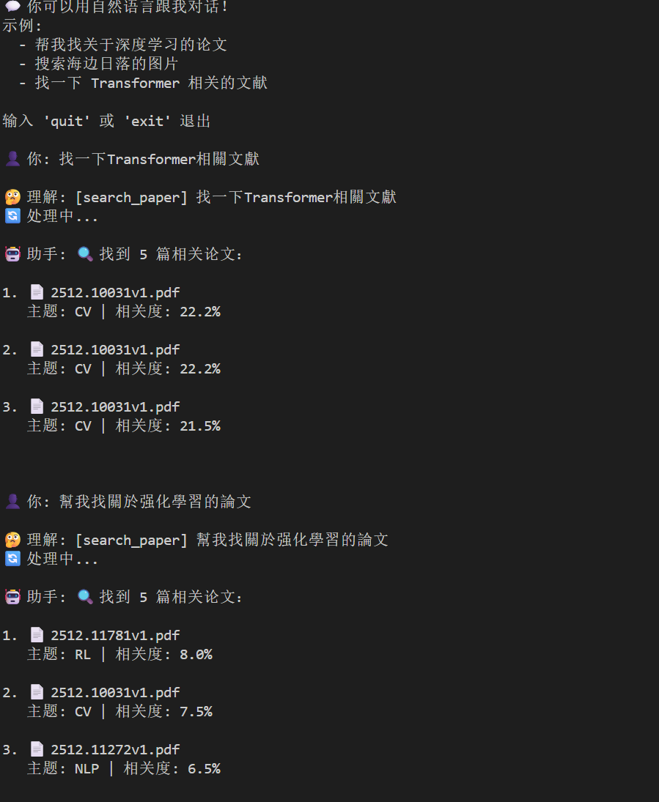
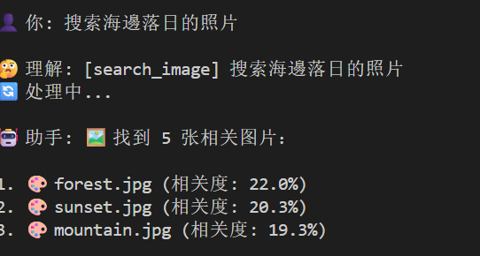
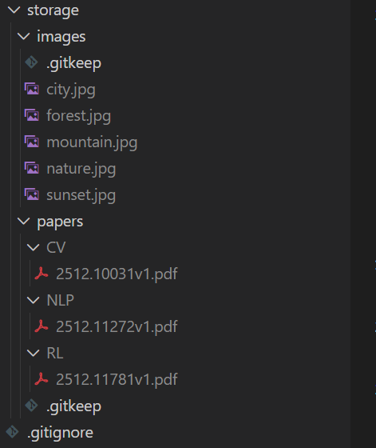
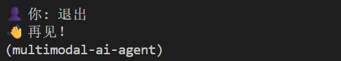

# 演示文档（Multimodal AI Agent）

本演示基于项目现有功能，展示以文搜文、以文搜图、文件落盘结构，以及退出流程。示例截图位于 `Example/` 目录。

## 运行环境与启动
- 确保 Ollama 服务已启动并已拉取模型（首次运行会自动拉取 `llama3`）。
- 进入项目根目录后运行聊天模式：
  ```
  uv run python main.py chat
  ```

## 功能演示截图

### 1. 以文搜文（论文检索）
- 输入示例：`找一下Transformer相关文献`
- 系统解析为 `search_paper`，返回匹配论文及相似度。
- 截图示例：
  

### 2. 以文搜文（强化学习）
- 输入示例：`帮我找关于强化学习的论文`
- 同样解析为 `search_paper`，展示多篇相关论文与相似度。
- 截图示例：同上图包含两个查询流程（Transformer + 强化学习）。

### 3. 以文搜图
- 输入示例：`搜索海边日落的照片`
- 解析为 `search_image`，返回本地图片库中最相关的图片及相似度。
- 截图示例：
  

### 4. 文件落盘结构
- 论文按照分类主题（CV/NLP/RL）存入 `storage/papers/<topic>/`，图片存入 `storage/images/`。
- 截图示例：
  

### 5. 退出流程
- 输入 `exit` 或 `quit` 退出聊天。
- 截图示例：
  

## 操作步骤速览
1. 启动 Ollama：`ollama serve`（已在后台的可略过）。
2. 运行聊天：`uv run python main.py chat`
3. 试用示例：
   - `找一下Transformer相关文献`
   - `帮我找关于强化学习的论文`
   - `搜索海边日落的照片`
4. 完成后输入 `exit` 退出。
